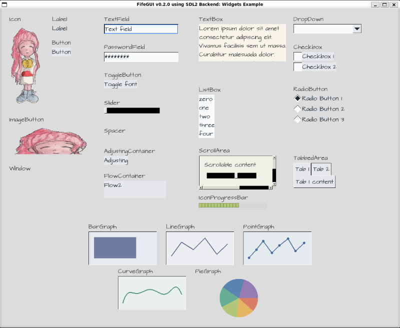
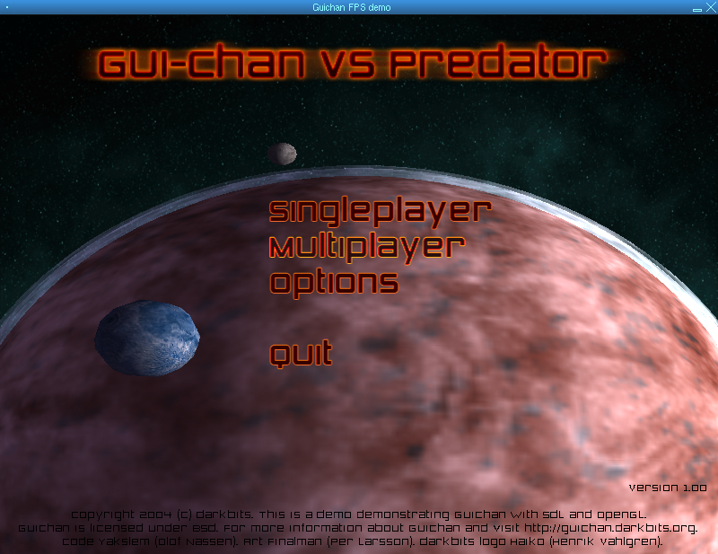
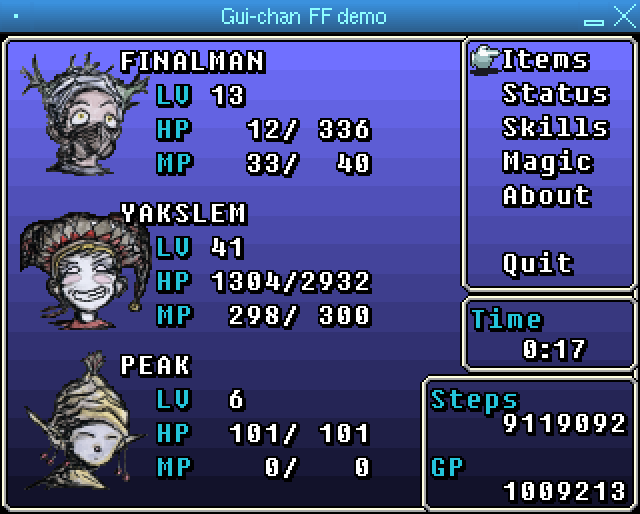

[Website](https://fifengine.github.io/fifechan/) | [Changelog](https://github.com/fifengine/fifechan/blob/main/CHANGELOG.md) | [Releases](https://github.com/fifengine/fifechan/releases) <!-- | [Docs](https://fifengine.github.io/fifechan/docs) --> | [API Docs](https://fifengine.github.io/fifechan/api/)

| Continuous Integration | Windows | Linux    |   Mac   |
|:----------------------:|:-------:|:--------:|:-------:|
| **Build Status** |  |  | Not Build |

# FifeGUI

FifeGUI is a lightweight, cross-platform C++ GUI library designed for games.

It offers a simple but powerful set of customizable widgets, allowing users to
create a wide range of widget types.

It supports rendering in SDL or OpenGL out of the box and it can be adapted to
use any rendering engine the user requires.

Events are pushed to FifeGUI, letting users choose their preferred input library
or use its built-in SDL input handling.

The main goal of FifeGUI is to remain lightweight, extendable,
and powerful enough to be used in any type of game.

## Screenshots

### SDLWidgets Demo

The SDLWidgets demo shows the built-in SDL rendering and input handling capabilities of FifeGUI. It demonstrates a variety of widgets, including buttons, sliders, text boxes, and more, all rendered using the SDL2 backend.

### FPS Demo

A demo showcasing a custom in-game overlay for a first-person shooter game, demonstrating the flexibility of FifeGUI in creating custom interfaces and integrating with game rendering.

### FF Demo

A menu in the style of the Final Fantasy series, demonstrating the flexibility of FifeGUI in creating custom interfaces.

## Downloads

#### Latest Releases

You find the latest releases on [Github Releases](https://github.com/fifengine/fifechan/releases).

#### Development Releases

We also provide releases for the latest successful build on Github Actions CI.

#### Availability in Package Repositories

FifeGUI is also already available from the following package repositories:

## License

FifeGUI is dual licensed under the [LGPL-2.1 License](/docs/license/LGPL-2.1-License.md) and [BSD License](/docs/license/BSD-License.md).

## Dev Notes

## Build Dependencies

You need the following libraries installed:

For [SDL](https://libsdl.org) support:
 - SDL2
 - SDL2_image
 - SDL2_ttf
 - SDL2_mixer (optional) (FPS demo)

For OpenGL support:
 - OpenGL
